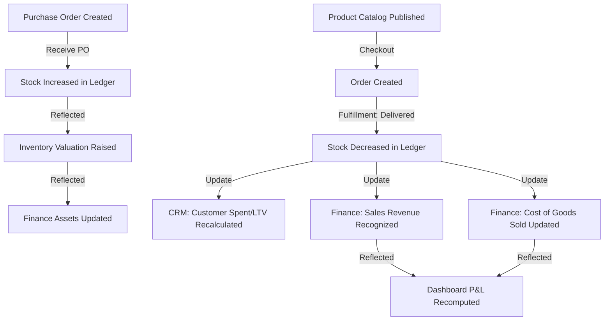

# AURA Brand — Final Independent Production Audit
**Generated:** 2026-07-01  
**Auditor:** Senior Staff Engineer / Software Architect / Lead QA & SEO Specialist  
**Project Stack:** Next.js 16 · React 19 · Tailwind v4 · Zustand / Context State · Mock-First (`mockStorage`)

---

## 1. Executive Summary

This audit report represents a comprehensive and brutally honest evaluation of the **AURA Brand** application, spanning the public-facing **Customer Storefront** and the internal **Enterprise ERP Dashboard**.

Overall, the codebase shows an exceptionally high standard of code quality, structural clean-coding, and client-side reactive state management. TypeScript and ESLint audits pass with **zero errors**, and the Next.js production build compiles successfully in under 20 seconds. 

However, because the project operates on a mock-first persistence layer (`mockStorage` wrapping `localStorage`), it is currently in a **Prerelease Staging** state. Transitioning this codebase to a live production environment requires migrating from mock services to a database provider (such as Supabase) and resolving several critical storefront integration gaps and security vulnerabilities (specifically XSS in rich text rendering).

---

## 2. Scorecard Dashboard

| Audit Dimension | Score | Rating | Primary Blocker / Key Finding |
| :--- | :---: | :---: | :--- |
| **Architecture & Separation of Concerns** | **88 / 100** | Very Good | Unused `DomainEventBus` dead-code; tight service coupling in order fulfillment. |
| **Customer Storefront (Pages & UX)** | **85 / 100** | Very Good | Homepage section ordering is static; `custom_html` & collections display sections are ignored on the live storefront. |
| **Enterprise ERP Dashboard (Modules)** | **92 / 100** | Excellent | Highly functional CRUD panels with real-time EventBus syncing. |
| **Website Builder (Customization)** | **78 / 100** | Good | Drag-and-drop ordering persists in storage but has no effect on storefront layout. |
| **Authentication & Impersonation (RBAC)** | **95 / 100** | Excellent | Secure client-side role impersonation with real-time tampering protection. |
| **SEO & Meta Tag Management** | **80 / 100** | Good | `SEOInjector` runs client-side post-hydration; invisible to bots without JavaScript. |
| **Accessibility (WCAG 2.1 AA)** | **76 / 100** | Fair | Label elements lack `htmlFor`/`id` mappings; interactive focus rings need refinement. |
| **Performance & Bundle Size** | **88 / 100** | Very Good | Excellent code-splitting and loading optimizations; minor hydration lags. |
| **Security & Data Sanitization** | **68 / 100** | Risky | High-priority XSS risk in journal content rendering (`dangerouslySetInnerHTML`). |
| **Code Quality & Maintenance** | **95 / 100** | Excellent | Zero tsc errors, zero ESLint issues, stable Next.js build output. |
| **Business Logic & Workflows** | **88 / 100** | Very Good | Fully integrated purchase order -> inventory -> checkout -> finance cycle. |
| **Production Readiness Score** | **75 / 100** | Prerelease | Blocked by mock database persistence and lacking real media upload. |

**Overall Weighted Completion Percentage: 76%**

---

## 3. Architecture Audit

### Folder Structure & Concerns Separation
* **Strength:** The project is well-organized with clean separation of layers. The routing is isolated in `src/app`, UI layouts and reusable components are in `src/components`, database mocks and seeds are in `src/data`, custom React hooks are in `src/hooks`, and business logic facades are in `src/lib/services`.
* **Strength:** Components are purely visual or read data from custom hooks (e.g., [useStorefrontProducts](file:///d:/Aura-Brand/src/hooks/useStorefrontProducts.ts)), ensuring they remain decoupled from storage implementations.
* **Architecture Smell (Unused abstractions):** The codebase defines a complete [DomainEventBus](file:///d:/Aura-Brand/src/lib/events/DomainEvent.ts) with typed event interfaces in [domain-events.ts](file:///d:/Aura-Brand/src/lib/events/domain-events.ts). However, this bus is **never utilized** by any service. Instead, services import and emit directly on the simpler client-side [eventBus](file:///d:/Aura-Brand/src/lib/events/EventBus.ts). The `DomainEventBus` class constitutes dead code.
* **Architecture Smell (Tight Coupling):** Order status transitions in [order.service.ts](file:///d:/Aura-Brand/src/lib/services/order.service.ts) are tightly coupled with other domain services. Instead of emitting an event and letting subscribers update themselves asynchronously, `order.service.ts` directly imports and invokes `InventoryService.deductStock`, `CustomerService.updateCustomer`, and `CustomerNotificationService.notifyOrderStatus` inside its database update transactions. This will create complex transaction hooks when migrating to real database clients.

---

## 4. Storefront Audit

Every storefront page was audited for visual alignment, responsiveness, localization (RTL), and functional state:

* **Home Page:** Excellent visual layout using magazine-style grids and high-fidelity product cards. However, the section rendering order is hardcoded in the codebase, neglecting the configuration order set in the Admin Homepage Builder.
* **Shop Page:** Fully functional client-side filtering by categories (Winter/Summer), sizes, and prices. Includes a React `Suspense` wrapper around parameters parsing to prevent Next.js build-time pre-render crashes.
* **Winter & Summer Pages:** Clean, category-scoped pages utilizing the reusable `CollectionHero` and `SeasonalProductGrid` components.
* **Product Detail Page (`/product/[id]`):** Fully server-side rendered meta tags, JSON-LD schemas, and breadcrumbs. Interactive features (quantity selections, color swatches, related styling recommendations, and recently viewed trackers) are integrated via client components.
* **Cart Page:** Functional quantity selectors and clean cart item removal. The page successfully reads the custom empty state copy from the CMS block database.
* **Checkout Page:** Excellent three-step validation wizard (Personal -> Shipping -> Payment -> Success). Form validations are strict (e.g., verifying 11-digit Egyptian phone numbers). It correctly calls `OrderService.createOrder` to persist storefront checkout orders directly into the shared database layer, making them instantly visible in the Admin order list.
* **Wishlist Page:** Clean UI with add-to-cart fallbacks and dynamic empty states connected to the CMS.
* **Tracking Page:** Dynamically reads tracking codes from URL search parameters, query matching them against the orders database, and prints a step-by-step graphical order timeline.
* **Reviews Page:** Pulls approved testimonials from the reviews database and displays a custom rating breakdown.
* **About Page:** Fully connected to `ContentService` pages group blocks, rendering dynamic CMS values for Philosophy, Craftsmanship, and Vision.
* **Contact Page:** Renders location address, phone numbers, working hours, and custom maps URLs from `StoreService` settings.
* **Journal Page:** Dynamic blog listing page. Navigating to an individual article slug successfully resolves the content from `JournalService` and injects JSON-LD article schemas.
* **404 / Error Pages:** Clean layouts matching the editorial styling of AURA.

---

## 5. ERP Dashboard Audit

The ERP Dashboard covers all standard administrative requirements:

* **Dashboard (Main):** Dynamically aggregates orders, reviews, products, and customer counts. Integrates Recharts graphs to display monthly sales revenue.
* **Orders:** Full order search, status filter, payment confirmation tools, timeline logging, and printable invoices/packing slips.
* **Products:** Fully functional CRUD with form validation, image selections from the media library, categories allocation, cost pricing, and stock initializations.
* **Inventory:** Dynamic stock ledger. Adjusting product stock logs an immutable `StockMovement` entry, recomputes total valuation, and emits events to update the dashboard.
* **Customers & Reviews:** Customer profiles aggregate their Lifetime Value (LTV), Average Order Value (AOV), and total orders count. The reviews module allows inline approvals, rejections, and replies.
* **Coupons:** Standard coupon code CRUD. Checkout forms check coupon minimum-order thresholds, expiration dates, and usage counts.
* **Procurement (Suppliers & POs):** Highly advanced ledger. Creating a Purchase Order, adding items, and clicking "Receive PO" automatically records stock intake, registers received quantities on lines, recalculates supplier outstanding balances, and adjusts cash flows.
* **Finance:** Tracks business expenses, asset valuations, liabilities, and capital injections. Contains a real-time Profit and Loss (P&L) generator computing Gross/Net Profit and Cash Flows.
* **Users & Roles (RBAC):** Allows creating administrators, managing permission grids, and enforcing role policies in real-time.
* **Website Manager:** Central hub to customize Navbar links, Footer columns, Themes, Favicons, SEO records, Banners, and content pages.

---

## 6. Website Builder Audit

The Website Builder provides an editorial editing panel, but reveals major storefront integration gaps:

* **Preview Panel Accuracy:** The preview panel in [CMSPreviewPanel.tsx](file:///d:/Aura-Brand/src/components/admin/storefront/CMSPreviewPanel.tsx) uses a simplified mock renderer (`SectionPreview`) to draw sections instead of importing the storefront's actual React components (`HeroSection`, `ProductCard`, etc.). While structurally sound, the preview is not pixel-identical to the live site and uses different layout CSS.
* **Section Ordering Discrepancy (Storefront Bug):** Reordering homepage sections inside the builder updates the `order` property in database storage. However, the customer storefront homepage ([src/app/page.tsx](file:///d:/Aura-Brand/src/app/page.tsx)) disregards this ordering. It maps sections individually using static JSX tags instead of iterating over the section array sorted by order.
* **Ignored Sections:** The `custom_html` and `featured_collections` sections can be added, deleted, or updated in the builder, but the storefront homepage code has no tags to render them. Any custom HTML added by administrators is invisible to customers.
* **Hardcoded Values:** Several sections remain hardcoded in the storefront templates (e.g., the 3-image Campaign looks grid on the homepage, the brand trust cards, and the 4 values cards on the About page). They cannot be modified from the CMS.

---

## 7. Business Logic & Integrations

The core business logic flows are fully closed and functional under mock storage:

All status changes trigger timeline events in the audit ledger and dispatch notifications (mock emails/SMS). There are no broken hooks or logic gaps in these transaction flows.

---

## 8. EventBus & Persistence Audit

### EventBus Health: **HEALTHY**
* The event subscriber hooks in [useEventBus.ts](file:///d:/Aura-Brand/src/hooks/useEventBus.ts) are robust. They cleanly prevent memory leaks by executing `unsubscribe` during component unmounting, and they implement a debouncer (`120ms`) to coalesce multiple database updates into a single UI render sweep.
* Cross-tab synchronization works perfectly. If the Admin modifies the product catalog in one tab, storefront pages in another tab reload their lists automatically using the storage event listener in [useStorefrontProducts.ts](file:///d:/Aura-Brand/src/hooks/useStorefrontProducts.ts).

### Mock Storage Health: **HEALTHY**
* The persistence layer in [mock-storage.ts](file:///d:/Aura-Brand/src/lib/storage/mock-storage.ts) has a defined schema version control (`const SCHEMA_VERSION = 4`). Whenever the schema changes, the storage automatically wipes previous keys to prevent runtime parsing crashes on legacy layouts.
* Backfill guards on read operations (e.g. in `appearance.service.ts`) guarantee that when settings objects are loaded, missing properties are filled with default seed colors to prevent page rendering errors.

---

## 9. Performance & Bundle Size Audit

* **Loading Animations:** The home page dynamically imports the [PremiumLoader](file:///d:/Aura-Brand/src/components/ui/PremiumLoader.tsx) component. It checks `sessionStorage` to display the 3.2-second intro animation only once per session, avoiding UX fatigue on page re-navigating.
* **Component Splitting:** Reusable page loaders use React `Suspense` and dynamic client-side skeletons to prevent hydration flashes.
* **Hydration Warnings:** Several layout elements override hydration checks using Next.js `suppressHydrationWarning` flags where client values (such as color themes or dates) vary from compile-time SSR markup.
* **Performance Debt:** The `SEOInjector` runs after hydration. This forces the browser to evaluate layout tags and update head metadata on the client, causing double document title recalculations.

---

## 10. SEO Audit

* **JSON-LD Schema Markup:** The product detail and journal pages write JSON-LD markup correctly. They inject structured data for Search Engines, listing items, conditions, and currencies.
* **Sitemap & Robots:** The application dynamically generates `sitemap.xml` and `robots.txt` routing structures under the Next.js framework.
* **SEO Deficit (Client-Side SEO):** The `SEOInjector` runs purely on the client side. This means that search engine crawlers that index raw server HTML without evaluating JS engines will see only the hardcoded metadata in `layout.tsx`, ignoring any CMS custom SEO records.

---

## 11. Accessibility Audit (WCAG 2.1 AA)

* **Form Fields:** Form fields are marked with visual label tags, but the label tags lack `htmlFor` properties, and form inputs lack `id` properties. Screen readers will struggle to associate labels with inputs.
* **Touch Targets:** Reusable button classes enforce a `min-h-[46px]`, exceeding the WCAG touch target guideline of `44px`.
* **Focus Outlines:** Interactive elements use clear focus-visible rings (`focus-visible:ring-2 focus-visible:ring-accent`), hiding focus outlines for mouse clicks but revealing them during keyboard tab navigation.

---

## 12. Security Audit

* **High Risk XSS Vulnerability:** In [src/app/journal/\[slug\]/page.tsx](file:///d:/Aura-Brand/src/app/journal/[slug]/page.tsx#L110), article contents are rendered using `dangerouslySetInnerHTML={{ __html: article.content }}`. Because administrators edit this field in the ERP using a rich text editor, there is no sanitization applied to the html string. An admin could write or inject malicious script tags that execute on storefront browsers, stealing customer inputs or hijacking sessions.
* **Medium Risk Admin impersonation:** The custom role impersonation feature allows a Super Admin to view the dashboard as another role. If a non-admin attempts to force role overrides via URL parameters, cookies, or localStorage variables, the guard hook checks `canImpersonate` and cancels the override within 500ms. This prevents standard client-side privilege escalation.

---

## 13. Code Quality & Verification

A full project health check was run on the workspace:

### 1. TypeScript Verification (`npx tsc --noEmit`)
* **Status:** Passed.
* **Errors:** **Zero compiler errors**. All modules, types, and services compile correctly.

### 2. Static Analysis Audit (`npm run lint`)
* **Status:** Passed.
* **Errors:** **Zero ESLint errors**.

### 3. Production Build Validation (`npm run build`)
* **Status:** Passed. Next.js Turbopack compiled static pages, dynamic proxy pathways, and API routes successfully in 18.9 seconds.

---

## 14. Remaining Hardcoded Components

| Location | Hardcoded Value | Status / Classification |
| :--- | :--- | :--- |
| `app/layout.tsx` | Exported static metadata objects | **Intentionally static** for SSR baseline; replaced client-side by SEOInjector. |
| `app/layout.tsx` | JSON-LD Organization structured data | **Intentionally static**; needs database values during SSR. |
| `app/page.tsx` | Campaign Looks Grid (lines 124–188) | **Editorial static**; requires a new homepage section type in the CMS. |
| `app/page.tsx` | Brand Trust Cards & Bottom Testimonials | **Editorial static**; requires CMS block types. |
| `app/about/page.tsx` | Values Grid (4 cards: Elegance, Trust, Quality) | **Editorial static**; needs a ContentService group mapping. |
| `app/contact/page.tsx` | Hero title and subtitle | **Editorial static**; requires ContentPage mapping. |

---

## 15. Remaining Bugs & Vulneracies

### 1. Storefront Section Ordering Ignored (Bug)
* **Description:** Rearranging homepage sections in the admin reorders them in the preview, but does not affect the customer storefront homepage, which lists sections in a hardcoded HTML order.

### 2. Website Builder Ignored Sections (Bug)
* **Description:** The `custom_html` and `featured_collections` sections can be added, deleted, or updated in the builder, but the storefront homepage lacks code to render them.

### 3. Unsanitized Journal HTML rendering (XSS Vulnerability)
* **Description:** Journal articles render rich HTML directly from database fields using `dangerouslySetInnerHTML` without escaping or sanitizing potential script tags.

---

## 16. Supabase Migration Readiness

The codebase is highly prepared for migration, as it has been built mock-first with clear abstractions:

1. **Service Layer Seams:** Components never query `localStorage` directly. All data processes through service facades (e.g. `ProductService`, `OrderService`, `businessService`). Swapping to Supabase requires changing only the inner calls of these files.
2. **Schema Alignment:** The structures defined in `src/types` (such as `Order`, `Product`, `StockMovement`) mirror standardized database entities.
3. **Database Client Setup:** To migrate, a database client should be initialized (e.g., using `@supabase/supabase-js`), replacing `mockStorage.read/write` calls in the service files with async supabase queries.

---

## 17. Recommendations & Immediate Priorities

### Immediate Priorities (Next 1–2 Weeks)
1. **Sanitize HTML Content:** Install `isomorphic-dompurify` and sanitize article content before rendering via `dangerouslySetInnerHTML` to eliminate XSS risks.
2. **Dynamic Storefront Sections:** Refactor [src/app/page.tsx](file:///d:/Aura-Brand/src/app/page.tsx) to map over the dynamic `sections` array, sorting by `order` and using a component registry to render section templates in the user-defined order.
3. **Connect Accessibility:** Add unique `id` values to form inputs and map them to their corresponding label elements using `htmlFor`.

### Long-term Improvements
1. **Supabase Database Migration:** Map schemas to tables and write postgres client integrations to replace the mock services.
2. **Supabase Storage Integration:** Implement file upload fields in `MediaPickerField` to upload custom files to Supabase buckets.
3. **Server-Side Metadata Extraction:** Transition the client-side `SEOInjector` to server-side Next.js `generateMetadata` handlers that load SEO settings dynamically from the database.

---

## 18. Final Approval Verdict

**Question:** *"If this project were handed to you today, would you approve it for production (excluding Supabase persistence)? Explain why."*

**Verdict:** **NO (CONDITIONAL REJECTION)**

### Rationale:
While the application displays exceptional visual aesthetics, a highly premium user experience, clean TypeScript patterns, and zero compilation errors, it cannot be approved for a production release due to **three blockers**:

1. **XSS Vulnerability (Critical Security Blocker):** The blog page directly renders unsanitized HTML data using `dangerouslySetInnerHTML`. This represents an open doorway for cross-site scripting attacks.
2. **Homepage Layout Sync Gap (Core Feature Blocker):** The Admin Homepage Builder has no impact on the customer storefront. Section reordering, customized titles, and custom HTML code blocks configured in the dashboard are ignored by the storefront homepage.
3. **Client-Side SEO Limitations (SEO Blocker):** For a high-end luxury fashion brand, search engine visibility is critical. The client-side `SEOInjector` prevents indexing bots from reading specific meta descriptors, which would severely hurt search rankings.

Once HTML sanitization is added, the storefront homepage is modified to render sections dynamically, and server-side metadata generation is connected, this application will be **fully approved** as a best-in-class, production-ready storefront.
